# TimescaleDB

- [TimescaleDB](#timescaledb)
  - [🕒 Key Features](#-key-features)
  - [🧱 Architecture Overview](#-architecture-overview)
  - [📂 Data Model](#-data-model)
  - [📊 Entity-Relationship Diagram](#-entity-relationship-diagram)
  - [🧱 Materialized Views](#-materialized-views)
  - [🔁 Continuous Aggregates](#-continuous-aggregates)
    - [Availability](#availability)
    - [Demand](#demand)
    - [Trips](#trips)

**TimescaleDB** is an open-source time-series database designed for high-performance and scalable analytics on time-stamped data. Built as a PostgreSQL extension, it offers full SQL support with optimizations tailored specifically for time-series workloads.

It combines the reliability and maturity of PostgreSQL with the performance of a purpose-built time-series engine — making it ideal for industrial IoT, finance, DevOps, mobility, and smart city applications.

---

## 🕒 Key Features

- 📈 **Efficient time-series storage and querying** at scale
- 💡 **Hypertables** automatically partition and optimize time-series data
- 🧠 **Advanced compression**, downsampling, and continuous aggregates
- 🔄 **Retention policies** for lifecycle management
- 🔧 **Native PostgreSQL compatibility**: SQL, JOINs, extensions (PostGIS, etc.)
- 🚀 **Scalable inserts and reads**, with parallelization and index optimizations

---

## 🧱 Architecture Overview

TimescaleDB enhances PostgreSQL with time-series-specific capabilities while maintaining full compatibility with existing PostgreSQL tooling.

At the core is the **hypertable**, a virtual table that abstracts away the partitioning of data into time and space-based chunks. This allows:

- Faster inserts (millions of rows per second)
- Parallelized queries across partitions
- Efficient compression of older data
- Smart policies for data retention and materialized views

It seamlessly integrates with existing PostgreSQL infrastructure, tools, and extensions.

---

## 📂 Data Model

The data model consists of several core tables optimized for time-series data. Overall, the tables can be categorized into:

- **Micromobility Tables:**
  - `demand`: Records of vehicle lends and returns at stations over time.
  - `availability`: Counts of available vehicles at stations over time.
  - `trips`: Individual trip records with start/end times and locations.
- **Contextual Tables:**
  - `weather`: Weather conditions (temperature, precipitation, etc.) over time.
  - `osm_data`: OpenStreetMap data for geographic context.
  - `foursquare_data`: Points of interest and venue data.
  - `holidays`: Public holidays data.
  - `vacations`: Vacation periods data.
  - `gtfs_data`: General Transit Feed Specification data for public transport context.
  - `bike_counting_stations`: Counts of bikes passing counting stations over time.
  - `demographics`: Population and socio-economic data by area.
- **Geographical Tables:**
  - `geo_information`: Geographic metadata for stations and locations.
  - `station_names`: Mapping of station IDs to human-readable names.
  - `wfs`: City area geometries.

## 📊 Entity-Relationship Diagram

The following entity-relationship diagram illustrates the database schema, including tables, their attributes, primary keys (PK), and foreign key (FK) relationships:

```mermaid
erDiagram
    geo_information ||--o{ availability : "has"
    geo_information ||--o{ demand : "has"
    geo_information ||--o{ trips : "lend location"
    geo_information ||--o{ trips : "return location"
    geo_information ||--o{ weather : "has"
    geo_information ||--o{ osm : "has"
    geo_information ||--o{ foursquare : "has"
    geo_information ||--o{ gtfs : "has"
    geo_information ||--o{ bike_counting_stations : "has"

    station_names ||--o{ availability : "has"
    station_names ||--o{ demand : "has"
    station_names ||--o{ trips : "lend station"
    station_names ||--o{ trips : "return station"

    geo_information {
        INTEGER location_id PK
        geography location
        TEXT continent_name
        TEXT country_name
        TEXT city_name
        TEXT federal_state_name
        INTEGER postal_code
    }

    station_names {
        INTEGER id PK
        TEXT name
    }

    availability {
        INTEGER location_id PK,FK
        TIMESTAMPTZ timestamp PK
        TEXT network_name PK
        INTEGER station_name_id FK
        TEXT station_id
        SMALLINT n_vehicles
    }

    demand {
        INTEGER location_id PK,FK
        TIMESTAMPTZ timestamp PK
        TEXT network_name PK
        INTEGER station_name_id FK
        TEXT station_id
        SMALLINT n_lends
        SMALLINT n_returns
    }

    trips {
        TEXT vehicle_id PK
        TIMESTAMPTZ timestamp_lend PK
        TIMESTAMPTZ timestamp_return
        TEXT station_id_lend
        TEXT station_id_return
        INTEGER station_name_id_lend FK
        INTEGER station_name_id_return FK
        TEXT network_name_lend
        TEXT network_name_return
        INTEGER location_id_lend FK
        INTEGER location_id_return FK
        SMALLINT pedelec_battery_lend
        SMALLINT pedelec_battery_return
        INTEGER current_range_meters_lend
        INTEGER current_range_meters_return
        BOOLEAN predicted
    }

    weather {
        INTEGER location_id PK,FK
        TIMESTAMPTZ timestamp PK
        DOUBLE_PRECISION temperature
        DOUBLE_PRECISION humidity
        DOUBLE_PRECISION precipitation
        DOUBLE_PRECISION wind_speed
        INTEGER wind_direction
    }

    osm {
        INTEGER id PK
        TIMESTAMPTZ timestamp PK
        INTEGER location_id FK
        TEXT entity_name
        TEXT name
        TEXT cuisine
        TEXT opening_hours
    }

    foursquare {
        TEXT fsq_id PK
        TEXT name
        INTEGER location_id FK
        TEXT categories
        DOUBLE_PRECISION popularity
        DOUBLE_PRECISION rating
        DOUBLE_PRECISION price
        TEXT hours_display
    }

    holidays {
        TEXT name PK
        DATE start_date PK
        TEXT federal_state_name PK
        DATE end_date
        TEXT type
    }

    vacations {
        TEXT name PK
        DATE start_date PK
        TEXT federal_state_name PK
        DATE end_date
        TEXT type
    }

    gtfs {
        TEXT route_long_name PK
        TEXT route_short_name PK
        INTEGER route_type PK
        INTEGER location_id PK,FK
        TIMESTAMPTZ arrival_time PK
        TIMESTAMPTZ departure_time PK
    }

    bike_counting_stations {
        INTEGER counter_id PK
        TIMESTAMPTZ timestamp PK
        INTEGER location_id FK
        TEXT counter_name
        INTEGER in_count
        INTEGER out_count
    }

    wfs {
        TEXT city PK
        TEXT name PK
        geometry area
    }

    demographics {
        TEXT topic
        TEXT city PK
        TEXT area PK
        TEXT feature PK
        TIMESTAMPTZ year PK
        DOUBLE_PRECISION value
    }
```



---

## 🧱 Materialized Views

**Materialized views** in PostgreSQL are query results stored on disk, allowing for fast read performance on complex or expensive queries. Unlike standard views, which compute results on the fly, materialized views persist data and must be manually refreshed when underlying data changes. They're ideal when real-time freshness isn't required but speed is.

- **Station Lifespans**

```sql
CREATE MATERIALIZED VIEW station_lifespans AS
SELECT
    t.station_id_lend AS station_id,
    t.station_name_id_lend AS station_name_id,
    s.name AS station_name,
    t.location_id_lend AS location_id,
    g.location AS location,
    t.network_name_lend AS network_name,
    MIN(t.timestamp_lend) AS first_seen,
    MAX(t.timestamp_lend) AS last_seen
FROM trips t
JOIN geo_information g
  ON t.location_id_lend = g.location_id
JOIN station_names s
  ON t.station_name_id_lend = s.id
WHERE t.station_id_lend IS NOT NULL
GROUP BY
    t.station_id_lend,
    t.station_name_id_lend,
    s.name,
    t.location_id_lend,
    t.network_name_lend,
    g.location
ORDER BY t.station_id_lend;
```

## 🔁 Continuous Aggregates

**Continuous aggregates** are TimescaleDB’s time-series-optimized version of materialized views. They automatically and incrementally update as new data is ingested, offering near real-time performance without the need for manual refreshes. They're perfect for dashboards, trend analysis, and historical rollups like hourly/daily summaries of large datasets. Each continuous aggregate has it's own refresh policy that is called daily and looks like this:

```sql
SELECT add_continuous_aggregate_policy('your_continuous_aggregate_name',
    start_offset => NULL,
    end_offset => NULL,
    schedule_interval => INTERVAL '1 day');
```

with the start_offset being changed according to the use case.

### Availability

- **Average Availability per 15 minutes by `location_id` and `network_name`, joined with `station_names`**

```sql
CREATE MATERIALIZED VIEW quarter_hourly_availability_agg
WITH (timescaledb.continuous) AS
SELECT
    time_bucket('15 minutes', a."timestamp") AS quarter_hour,
    a.location_id,
    a.network_name,
    a.station_name_id,
    a.station_id,
    AVG(a.n_vehicles) AS avg_availability,
    sn."name" AS station_name
FROM public.availability a
LEFT JOIN public.station_names sn
    ON a.station_name_id = sn.id
GROUP BY quarter_hour, a.location_id, a.network_name, a.station_id, a.station_name_id, sn."name"
ORDER BY quarter_hour;
```

- **Average Availability per hour by `location_id` and `network_name`, joined with `station_names`**

```sql
CREATE MATERIALIZED VIEW hourly_availability_agg
WITH (timescaledb.continuous) AS
SELECT
    time_bucket('1 hour', a."timestamp") AS hour,
    a.location_id,
    a.network_name,
    a.station_name_id,
    a.station_id,
    AVG(a.n_vehicles) AS avg_availability,
    sn."name" AS station_name
FROM public.availability a
LEFT JOIN public.station_names sn
    ON a.station_name_id = sn.id
GROUP BY hour, a.location_id, a.network_name, a.station_id, a.station_name_id, sn."name"
ORDER BY hour;
```

- **Average Availability per 12h by `location_id` and `network_name`, joined with `station_names`**

```sql
CREATE MATERIALIZED VIEW half_daily_availability_agg
WITH (timescaledb.continuous) AS
SELECT
    time_bucket('12 hours', "hour") AS half_day,
    location_id,
    network_name,
    station_name_id,
    station_id,
    AVG(avg_availability) AS avg_availability,
    station_name
FROM hourly_availability_agg
GROUP BY half_day, location_id, network_name, station_id, station_name_id, station_name
ORDER BY half_day;
```

- **Average Availability per day by `location_id` and `network_name`, joined with `station_names`**

```sql
CREATE MATERIALIZED VIEW daily_availability_agg
WITH (timescaledb.continuous) AS
SELECT
    time_bucket('1 day', "hour") AS day,
    location_id,
    network_name,
    station_name_id,
    station_id,
    AVG(avg_availability) AS avg_availability,
    station_name
FROM hourly_availability_agg
GROUP BY day, location_id, network_name, station_id, station_name_id, station_name
ORDER BY day;
```

- **Average Availability per week by `location_id` and `network_name`, joined with `station_names`**

```sql
CREATE MATERIALIZED VIEW weekly_availability_agg
WITH (timescaledb.continuous) AS
SELECT
    time_bucket('1 week', "day") AS week,
    location_id,
    network_name,
    station_name_id,
    station_id,
    AVG(avg_availability) AS avg_availability,
    station_name
FROM daily_availability_agg
GROUP BY week, location_id, network_name, station_id, station_name_id, station_name
ORDER BY week;
```

- **Average Availability per month by `location_id` and `network_name`, joined with `station_names`**

```sql
CREATE MATERIALIZED VIEW monthly_availability_agg
WITH (timescaledb.continuous) AS
SELECT
    time_bucket('1 month', "day") AS month,
    location_id,
    network_name,
    station_name_id,
    station_id,
    AVG(avg_availability) AS avg_availability,
    station_name
FROM daily_availability_agg
GROUP BY month, location_id, network_name, station_id, station_name_id, station_name
ORDER BY month;
```

### Demand

- ** Demand per 15 minutes by `location_id` and `network_name`, joined with `station_names`**

```sql
CREATE MATERIALIZED VIEW quarter_hourly_demand_agg
WITH (timescaledb.continuous) AS
SELECT
    time_bucket('15 minutes', d."timestamp") AS quarter_hour,
    d.location_id,
    d.network_name,
    d.station_name_id,
    d.station_id,
    SUM(d.n_lends) AS total_lends,
    SUM(d.n_returns) AS total_returns,
    sn."name" AS station_name
FROM public.demand d
LEFT JOIN public.station_names sn
    ON d.station_name_id = sn.id
GROUP BY quarter_hour, d.location_id, d.network_name, d.station_id, d.station_name_id, sn."name"
ORDER BY quarter_hour;
```

- **Demand per hour by `location_id` and `network_name`, joined with `station_names`**

```sql
CREATE MATERIALIZED VIEW hourly_demand_agg
WITH (timescaledb.continuous) AS
SELECT
    time_bucket('1 hour', d."timestamp") AS hour,
    d.location_id,
    d.network_name,
    d.station_name_id,
    d.station_id,
    SUM(d.n_lends) AS total_lends,
    SUM(d.n_returns) AS total_returns,
    sn."name" AS station_name
FROM public.demand d
LEFT JOIN public.station_names sn
    ON d.station_name_id = sn.id
GROUP BY hour, d.location_id, d.network_name, d.station_id, d.station_name_id, sn."name"
ORDER BY hour;
```

- **Demand per 12h by `location_id` and `network_name`, joined with `station_names`**

```sql
CREATE MATERIALIZED VIEW half_daily_demand_agg
WITH (timescaledb.continuous) AS
SELECT
    time_bucket('12 hours', "hour") AS half_day,
    location_id,
    network_name,
    station_name_id,
    station_id,
    SUM(total_lends) AS total_lends,
    SUM(total_returns) AS total_returns,
    station_name
FROM hourly_demand_agg
GROUP BY half_day, location_id, network_name, station_id, station_name_id, station_name
ORDER BY half_day;
```

- **Demand per day by `location_id` and `network_name`, joined with `station_names`**

```sql
CREATE MATERIALIZED VIEW daily_demand_agg
WITH (timescaledb.continuous) AS
SELECT
    time_bucket('1 day', "hour") AS day,
    location_id,
    network_name,
    station_name_id,
    station_id,
    SUM(total_lends) AS total_lends,
    SUM(total_returns) AS total_returns,
    station_name
FROM hourly_demand_agg
GROUP BY day, location_id, network_name, station_id, station_name_id, station_name
ORDER BY day;
```

- **Demand per week by `location_id` and `network_name`, joined with `station_names`**

```sql
CREATE MATERIALIZED VIEW weekly_demand_agg
WITH (timescaledb.continuous) AS
SELECT
    time_bucket('1 week', "day") AS week,
    location_id,
    network_name,
    station_name_id,
    station_id,
    SUM(total_lends) AS total_lends,
    SUM(total_returns) AS total_returns,
    station_name
FROM daily_demand_agg
GROUP BY week, location_id, network_name, station_id, station_name_id, station_name
ORDER BY week;
```

- **Demand per month by `location_id` and `network_name`, joined with `station_names`**

```sql
CREATE MATERIALIZED VIEW monthly_demand_agg
WITH (timescaledb.continuous) AS
SELECT
    time_bucket('1 month', "day") AS month,
    location_id,
    network_name,
    station_name_id,
    station_id,
    SUM(total_lends) AS total_lends,
    SUM(total_returns) AS total_returns,
    station_name
FROM daily_demand_agg
GROUP BY month, location_id, network_name, station_id, station_name_id, station_name
ORDER BY month;
```

### Trips

- **Trips per hour by `network_name_lend` and `network_name_return`**

```sql
CREATE MATERIALIZED VIEW hourly_trips_agg
WITH (timescaledb.continuous) AS
SELECT
    time_bucket('1 hour', timestamp_lend) AS hour,
    count(*) AS trip_count,
    network_name_lend,
    network_name_return
FROM trips
GROUP BY hour, network_name_lend, network_name_return
order by hour;
```

- **Trips per 12h by `network_name_lend` and `network_name_return`**

```sql
CREATE MATERIALIZED VIEW half_daily_trips_agg
WITH (timescaledb.continuous) AS
SELECT
    time_bucket('12 hours', hour) AS half_day,
    sum(trip_count) AS trip_count,
    network_name_lend,
    network_name_return
FROM hourly_trips_agg
GROUP BY half_day, network_name_lend, network_name_return
order by half_day;
```

- **Trips per day by `network_name_lend` and `network_name_return`**

```sql
CREATE MATERIALIZED VIEW daily_trips_agg
WITH (timescaledb.continuous) AS
SELECT
    time_bucket('1 day', half_day) AS day,
    sum(trip_count) AS trip_count,
    network_name_lend,
    network_name_return
FROM half_daily_trips_agg
GROUP BY day, network_name_lend, network_name_return
order by day;
```

- **Trips per week by `network_name_lend` and `network_name_return`**

```sql
CREATE MATERIALIZED VIEW weekly_trips_agg
WITH (timescaledb.continuous) AS
SELECT
    time_bucket('1 week', day) AS week,
    sum(trip_count) AS trip_count,
    network_name_lend,
    network_name_return
FROM daily_trips_agg
GROUP BY week, network_name_lend, network_name_return
order by week;
```

- **Trips per month by `network_name_lend` and `network_name_return`**

```sql
CREATE MATERIALIZED VIEW monthly_trips_agg
WITH (timescaledb.continuous) AS
SELECT
    time_bucket('1 month', day) AS month,
    sum(trip_count) AS trip_count,
    network_name_lend,
    network_name_return
FROM daily_trips_agg
GROUP BY month, network_name_lend, network_name_return
order by month;
```
